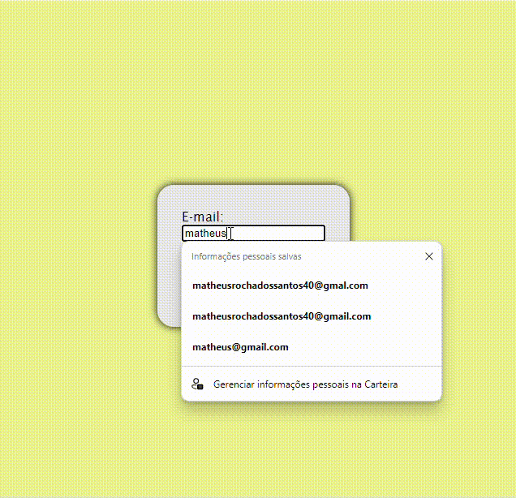

# ``📒Explicação Detalhada``

## Meta Tags e Título:

>* charset='utf-8': Define o conjunto de caracteres como UTF-8 para suportar caracteres internacionais.
http-equiv='X-UA-Compatible' content='IE=edge': Define o modo de compatibilidade do navegador Internet Explorer.
title Validação de E-mail title: Define o título da página.

## Viewport Meta Tag:

>* meta name='viewport' content='width=device-width, initial-scale=1'>: Essencial para o design responsivo, ajusta a largura da página ao dispositivo e define a escala inicial.

## CSS Externo:

>* link rel='stylesheet' type='text/css' media='screen' href='main.css': Importa um arquivo CSS externo chamado 'main.css' para estilização da página.

## Corpo do Documento:

> * div class="container">: Abre uma div com a classe 'container', que envolve todo o conteúdo principal.
form action="" id="email" class="form">: Abre um formulário com id 'email' e classe 'form'. O atributo action="" significa que o formulário ainda não possui uma ação definida para onde os dados serão enviados.
label for="emailUser">E-mail:label>: Rótulo para o campo de entrada de e-mail, associado ao input com id 'emailUser'.
input type="text" id="emailUser" name="email" onblur="checarEmail()">: Campo de entrada de texto para o e-mail, com id 'emailUser', nome 'email' e um evento onblur que chama a função checarEmail() quando o campo perde o foco.
input type="submit" id="btnValidar" value="VALIDAR">: Botão de submit com id 'btnValidar' e valor 'VALIDAR'.

## JavaScript Externo:

>* script src='email.js'>/script>: Inclui um arquivo JavaScript externo chamado 'email.js', que provavelmente contém funções para validar o e-mail e manipular eventos.
Conclusão
Este código cria uma estrutura básica de página HTML com um formulário para validação de e-mail. Ele utiliza arquivos externos de CSS e JavaScript para estilização e funcionalidade adicional, respectivamente. O JavaScript associado pode conter lógica para validar o formato do e-mail antes de enviar o formulário.

 

# ``💾Função checarEmail()``

>A função checarEmail() é responsável por verificar se o valor inserido em um campo de entrada de e-mail atende a critérios básicos de validação. Vamos analisar o código linha por linha:

## Explicação Detalhada

### Condições de Validação:

* document.forms[ 0 ].email.value == "": Verifica se o campo de entrada de e-mail está vazio.

* document.forms[ 0 ].email.value.indexOf('@') == -1: Verifica se o campo de e-mail não contém o caractere '@', que é essencial para um e-mail válido.

* document.forms[ 0 ].email.value.indexOf('.') == -1: Verifica se o campo de e-mail não contém o caractere '.' (ponto), necessário para separar o nome do domínio no endereço de e-mail.

### Alertas:

* Se qualquer uma das condições acima for verdadeira (indicando que o e-mail não é válido), um alerta é exibido com a mensagem "Por favor, informe um e-mail válido".
Em seguida, a função retorna false, indicando que a validação falhou.

### Sucesso na Validação:

* Se todas as condições de validação forem falsas (ou seja, o e-mail é considerado válido), um alerta é exibido com a mensagem "E-mail informado com sucesso".

* O conteúdo do elemento HTML com id 'email' é atualizado para exibir o valor do e-mail informado pelo usuário. Isso é feito usando document.getElementById('email').innerHTML = document.getElementById('emailUser').value;.

### Uso da Função:

* Esta função deve ser chamada no evento onblur do campo de entrada de e-mail (input type="text" id="emailUser" name="email" onblur="checarEmail()"). Isso significa que a função checarEmail() será executada quando o usuário preencher o campo de e-mail e clicar fora dele (quando perder o foco).

### Finalidade:
* A finalidade principal desta função é fornecer uma validação simples do formato de e-mail diretamente no navegador do usuário. Ela verifica se o campo de e-mail contém caracteres essenciais como '@' e '.', alertando o usuário caso esses critérios não sejam atendidos. A função também fornece feedback imediato sobre a validade do e-mail inserido.

### Observações:

* Esta função realiza apenas uma validação básica do formato do e-mail. Para uma validação mais robusta, especialmente em aplicações web, é recomendável utilizar métodos adicionais, como expressões regulares em JavaScript ou validação no servidor, para garantir a integridade dos dados.
Espero que essa explicação ajude a entender o funcionamento e a aplicação da função checarEmail() no contexto de um formulário de validação de e-mail.

# ``💽CSS Explicado:``

>* html, body: Seleciona tanto o elemento html> quanto o elemento body> do documento HTML.
>* padding: 0;: Remove qualquer preenchimento (espaço) ao redor do conteúdo do html> e body>.
>* height: 100%;: Define a altura do html> e body> como 100% da altura da janela de visualização do navegador.
>* font-family: Define a família de fontes a ser usada para o texto dentro do body>.
>* display: flex;: Aplica o modelo de layout flexível ao body>, o que facilita o alinhamento dos elementos filhos.
>* background-color: rgb(236, 236, 139);: Define a cor de fundo do body> como um tom de amarelo claro usando valores RGB.
>* container: Seletor de classe para elementos com a classe container.
>* display: flex;: Aplica o modelo de layout flexível ao .container, permitindo alinhamento fácil de elementos filhos.
>* justify-content: center;: Centraliza horizontalmente os itens dentro do .container.
>* align-items: center;: Centraliza verticalmente os itens dentro do .container.
>* width: 100%; height: 100%;: Define a largura e a altura do .container como 100% da largura e altura do seu contêiner pai (neste caso, o body>).

 

 

  <h2>
  Essa primeira parte do projeto foi a pagina do capo E-mail e todas as funções que foram utilizadas nele agora vamos para a segunda parte que vai ser:
  </H2>
 
 # ``🧑‍🤝‍🧑validação do CPF``
 Este código HTML cria uma página web simples para validar um CPF (Cadastro de Pessoa Física). A estrutura principal inclui:

Declaração do Documento: Define o documento como HTML5.

Cabeçalho (head>):

* Configura a codificação de caracteres para UTF-8.
* Define a compatibilidade com o Internet Explorer para a versão mais recente.
* Define o título da página exibido na aba do navegador.
* Ajusta a viewport para responsividade em dispositivos móveis.
* Inclui um link para o arquivo de estilo CSS (cpf.css) para a formatação da página.
* Corpo (body>):

>Contém um div> com a classe container para centralizar o conteúdo.
Um formulário (form>) com:
Campo de Entrada: Para inserir o CPF, limitado a 14 caracteres.
Botão de Envio: Para submeter o formulário e acionar a validação.
Parágrafo: Para exibir mensagens de validação ou erros.
Inclui um script JavaScript (cpf.js) para gerenciar a lógica de validação do CPF.
Este código proporciona uma interface básica para a validação de CPF, com estilos e funcionalidades adicionais implementados em arquivos externos CSS e JavaScript.

## ``💽Código CSS``
Este CSS define o estilo e layout da página de validação de CPF:

* html, body: Remove o preenchimento padrão e define a altura para 100% da janela de visualização. O corpo utiliza uma fonte sans-serif e tem um fundo amarelo claro.

* container: Centraliza o conteúdo vertical e horizontalmente, ocupando toda a altura e largura da página.

* form: Aplica um fundo cinza claro, padding de 30px, bordas arredondadas de 20px e uma sombra preta ao formulário. Os itens dentro do formulário são dispostos em uma coluna.

* button: Estiliza o botão com uma cor de fundo amarela clara, bordas arredondadas de 8px, padding de 15px e uma margem superior de 30px.

* input#cpf: Define a altura do campo de entrada como 30px, com bordas arredondadas de 8px e sem borda.
Esses estilos proporcionam uma aparência limpa e centralizada para a interface de validação de CPF.

## ``📚Código JavaScript``

Quando o Formulário é Enviado:

* O formulário não é enviado de verdade; em vez disso, o código verifica o CPF que você digitou.
Obtém o CPF Digitado:

* Pega o número do CPF que você inseriu e a área onde as mensagens serão mostradas.
Valida o CPF:

* Verifica se o CPF é válido usando uma função que realiza cálculos específicos.
Mostra uma Mensagem:

* Se o CPF for válido, exibe "O CPF é válido!" em verde.
Se não for válido, exibe "O CPF é inválido!" em vermelho.
Função de Validação do CPF:

>Limpa o CPF: Remove caracteres não numéricos (como pontos e hífens).
Verifica Tamanho e Sequências: O CPF deve ter 11 dígitos e não pode ser uma sequência de números iguais.
Calcula e Verifica Dígitos: Usa cálculos específicos para garantir que os dois últimos dígitos do CPF estão corretos.
Em resumo, este código verifica se o CPF digitado é válido e mostra uma mensagem apropriada na tela.

